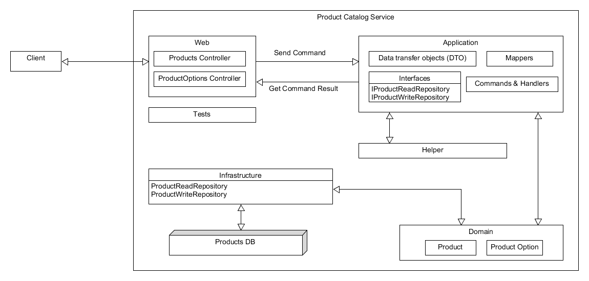
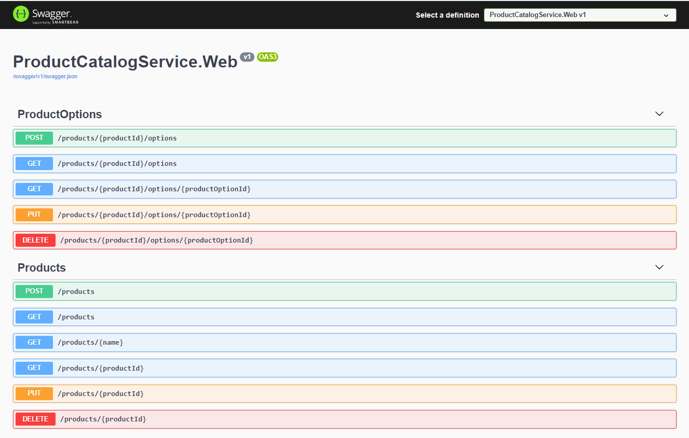

# Objective

The source code under `src-original` is a poorly written products API in C#.

The objective of this assigment is to refactor and improve code considering all aspects of good software engineering and make it a production ready code.

## API Requirements

There should be these endpoints:

1. `GET /products` - gets all products.
2. `GET /products?name={name}` - finds all products matching the specified name.
3. `GET /products/{id}` - gets the project that matches the specified ID - ID is a GUID.
4. `POST /products` - creates a new product.
5. `PUT /products/{id}` - updates a product.
6. `DELETE /products/{id}` - deletes a product and its options.
7. `GET /products/{id}/options` - finds all options for a specified product.
8. `GET /products/{id}/options/{optionId}` - finds the specified product option for the specified product.
9. `POST /products/{id}/options` - adds a new product option to the specified product.
10. `PUT /products/{id}/options/{optionId}` - updates the specified product option.
11. `DELETE /products/{id}/options/{optionId}` - deletes the specified product option

All models are specified in the `/Models` folder, but should conform to:

**Product:**
```
{
  "Id": "01234567-89ab-cdef-0123-456789abcdef",
  "Name": "Product name",
  "Description": "Product description",
  "Price": 123.45,
  "DeliveryPrice": 12.34
}
```

**Products:**
```
{
  "Items": [
    {
      // product
    },
    {
      // product
    }
  ]
}
```

**Product Option:**
```
{
  "Id": "01234567-89ab-cdef-0123-456789abcdef",
  "Name": "Product name",
  "Description": "Product description"
}
```

**Product Options:**
```
{
  "Items": [
    {
      // product option
    },
    {
      // product option
    }
  ]
}
```

## High level overview



## Development

The refactored source code is available under `src` folder;

The project is based on `ASP.NET Core 5.0` using `Visual Studio 2019`. However feel free to run using `Visual Studio Code`.

### Build

`dotnet build`

### Test

`dotnet test`

### Run

`dotnet run --project ProductCatalogService.Web`

### Swagger UI

APIs can be tested using swagger at https://localhost:5001/swagger/index.html. 



### Postman Collection

The postman scripts are located under `postman-collections` folder. Ensure you setup environment variable named `ApiUrl` to point to local web server url. In our case it would be http://localhost:5000/.


